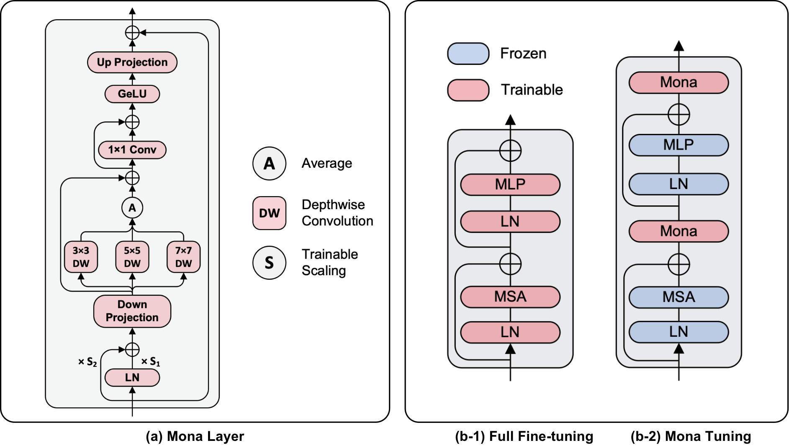
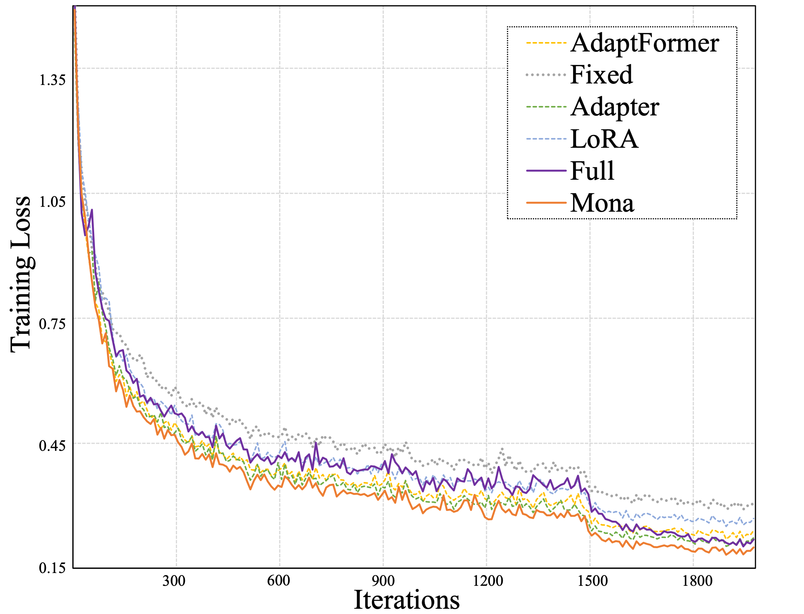

# Mona

The official implementation of "[Adapter is All You Need for Tuning Visual Tasks](https://arxiv.org/pdf/2311.15010.pdf)".

## Table of Contents

- [Introduction](#introduction)
- [Main Results](#main-results)
- [Getting Started](#getting-started)
- [Citation](#citation)
- [Acknowledgement](#acknowledegment)


# Introduction

Pre-training & fine-tuning can enhance the transferring efficiency and performance in visual tasks. Recent deltatuning 
methods provide more options for visual classification tasks. Despite their success, existing visual delta-tuning art 
fails to exceed the upper limit of full fine-tuning on challenging tasks like instance segmentation and semantic 
segmentation. To find a competitive alternative to full fine-tuning, we propose the Multi-cognitive Visual Adapter (Mona) 
tuning, a novel adapter-based tuning method.



Mona achieves the strong performance on COCO object detection (`53.4 box AP` and `46.0 mask AP` on `test-dev` with 
Swin-Base), and ADE20K semantic segmentation (`51.36 mIoU` on `val` with Swin-Large).

# Main Results

The proposed Mona outperforms full fine-tuning on representative visual tasks, which promotes the upper limit of previous 
delta-tuning art. The results demonstrate that the adapter-tuning paradigm can replace full fine-tuning and achieve 
better performance in most visual tasks. Full fine-tuning may no longer be the only preferred solution for transfer 
learning in the future.


Note: 
- We report the results with `Cascade Mask R-CNN` (Swin-Base) and `UperNet` (Swin-Large) framework for COCO and ADE20K 
respectively.
- The pre-trained weights are IM22K-Supervied pre-trained [Swin-Base](https://drive.google.com/file/d/10-pbubW1-80W0SgWdGP20Q_cm6MlrDpN/view?usp=drive_link
) and [Swin-Large](https://drive.google.com/file/d/142x0CCSItr5p05ea3oylWGaW9MEgnXKU/view?usp=drive_link).

---

Moreover, Mona converges faster than other tested delta-tuning arts.



Note:
- We obtain the loss on `VOC` dataset with `RetinaNet` equipped with Swin-Large.

# Getting Started
## Object Detection & Instance Segmentation
### Installation
Please refer to [Swin-Transformer-Object-Detection](Swin-Transformer-Object-Detection/docs/get_started.md) for the 
environments and dataset preparation.

### Training Mona

After organizing the dataset, you have to modify the config file according to your environments.
- `data_root`, have to be set as the actual dataset path.
- `load_from`, should be set to your pre-trained weight path.
- `norm_cfg`, have to be set to `SyncBN` if you train the model with multi-gpus.

Please execute the following command in the project path.
#### COCO
```shell
bash Swin-Transformer-Object-Detection/tools/dist_train.sh Swin-Transformer-Object-Detection/mona_configs/swin-b_coco/cascade_mask_swin_base_3x_coco_sample_1_bs_16_mona.py `Your GPUs`
```

#### VOC
```shell
bash Swin-Transformer-Object-Detection/tools/dist_train.sh Swin-Transformer-Object-Detection/mona_configs/swin-b_coco/cascade_mask_swin_base_3x_coco_sample_1_bs_16_mona.py `Your GPUs`
```


## Semantic Segmentation
### Installation

Please refer to [Swin-Transformer-Semantic-Segmentation](Swin-Transformer-Semantic-Segmentation/docs/get_started.md) for
the environments and dataset preparation.

### Training Mona 
Follow the guidance in [Object Detection & Instance Segmentation](#object-detection--instance-segmentation) to check your config file.

Please execute the following command in the project path.
#### ADE20K
```shell
bash Swin-Transformer-Semantic-Segmentation/tools/dist_train.sh Swin-Transformer-Semantic-Segmentation/mona_configs/swin-l_ade20k/ade20k_upernet_swin_large_160k_mona.py `Your GPUs`
```

## Classification
### Installation

Please refer to [Swin-Transformer-Classification](Swin-Transformer-Classification/README.md) for environments.
the environments.

Note:
- We reorganize the dataset format to match the requirements of mmclassification.
- You can follow the following format:
```
mmclassification
└── data
    └── my_dataset
        ├── meta
        │   ├── train.txt
        │   ├── val.txt
        │   └── test.txt
        ├── train
        ├── val
        └── test
```

### Training Mona 
Follow the guidance in [Object Detection & Instance Segmentation](#object-detection--instance-segmentation) to check your config file.

Please execute the following command in the project path.
#### Oxford Flower
```shell
bash Swin-Transformer-Classification/tools/dist_train.sh Swin-Transformer-Classification/mona_configs/swin-l_oxford-flower/swin-large_4xb8_oxford_flower_mona.py `Your GPUs`
```

#### Oxford Pet
```shell
bash Swin-Transformer-Classification/tools/dist_train.sh Swin-Transformer-Classification/mona_configs/swin-l_oxford-flower/swin-large_4xb8_oxford_pet_mona.py `Your GPUs`
```

#### Oxford VOC
```shell
bash Swin-Transformer-Classification/tools/dist_train.sh Swin-Transformer-Classification/mona_configs/swin-l_oxford-flower/swin-large_4xb8_voc_mona.py `Your GPUs`
```

# Citation
If our work is helpful for your research, please cite:
```angular2html

Mona Arxiv Url.

```


# Acknowledgement
We are grateful for the following, but not limited to these, wonderful open-source repositories.
- [Swin-Transformer](https://github.com/microsoft/Swin-Transformer)
- [mmclassification](https://github.com/open-mmlab/mmpretrain)
- [NOAH](https://github.com/ZhangYuanhan-AI/NOAH)
- [LoRA](https://github.com/microsoft/LoRA)
- [Adaptformer](https://github.com/ShoufaChen/AdaptFormer)