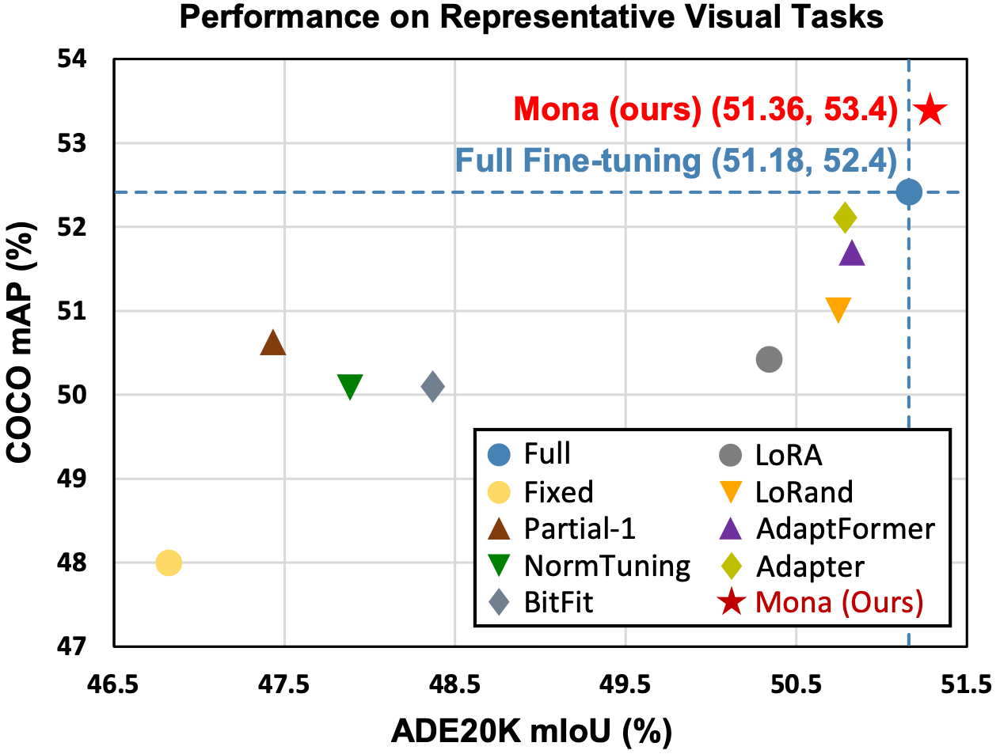

# Mona

The official implementation of "[Adapter is All You Need for Tuning Visual Tasks](None)".

## Table of Contents

- [Introduction](#Introduction)
- [Main Results](#Main Results)
- [Getting Started](#Getting Started)
- [Usage](#usage)
- [Contributing](#contributing)
- [Dev](#dev)

# Introduction

Pre-training & fine-tuning can enhance the transferring efficiency and performance in visual tasks. Recent deltatuning 
methods provide more options for visual classification tasks. Despite their success, existing visual delta-tuning art 
fails to exceed the upper limit of full fine-tuning on challenging tasks like instance segmentation and semantic 
segmentation. To find a competitive alternative to full fine-tuning, we propose the Multi-cognitive Visual Adapter (Mona) 
tuning, a novel adapter-based tuning method.

Mona achieves the strong performance on COCO object detection (`53.4 box AP` and `46.0 mask AP` on `test-dev` with 
Swin-Base), and ADE20K semantic segmentation (`53.4 mIoU` on `val` with Swin-Base).

# Main Results

The proposed Mona outperforms full fine-tuning on representative visual tasks, which promotes the upper limit of previous 
delta-tuning art. The results demonstrate that the adapter-tuning paradigm can replace full fine-tuning and achieve 
better performance in most visual tasks. Full fine-tuning may no longer be the only preferred solution for transfer 
learning in the future.

# Getting Started

